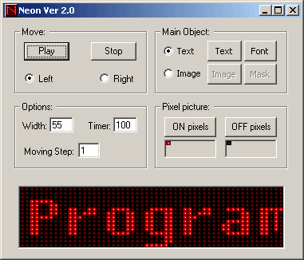



## Neon 2

### Description

Animate any text on an electronical neon board

« Neon Release 2 »

it's algorith is modified so this version is about 100 times faster than previouse release! and is much simpler

also use winapi functions BitBlt and GetPixel for more speed<

Exciting program, SEE and Enjoy!

S.Serpooshan, (2003)
 
### More Info
 

             |
---                |---
**Submitted On**   |2003-09-25 09:21:18
**By**             |[S\.Serpooshan](https://github.com/Planet-Source-Code/PSCIndex/blob/master/ByAuthor/s-serpooshan.md)
**Level**          |Intermediate
**User Rating**    |4.6 (148 globes from 32 users)
**Compatibility**  |VB 6\.0
**Category**       |[Graphics](https://github.com/Planet-Source-Code/PSCIndex/blob/master/ByCategory/graphics__1-46.md)
**World**          |[Visual Basic](https://github.com/Planet-Source-Code/PSCIndex/blob/master/ByWorld/visual-basic.md)
**Archive File**   |[Neon\_21654981072003\.zip](https://github.com/Planet-Source-Code/s-serpooshan-neon-2__1-49027/archive/master.zip)

